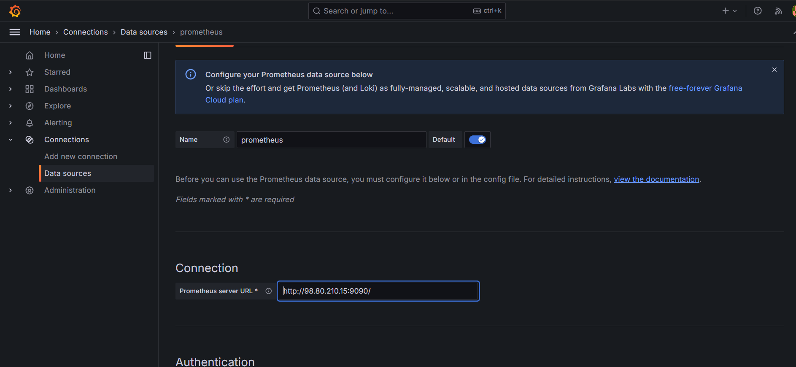
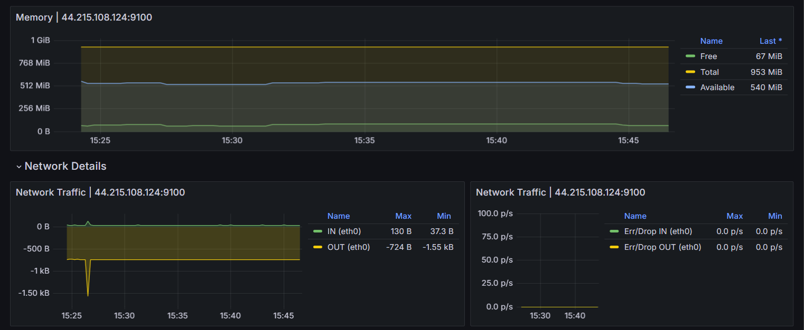

## Terraform + Docker + AWS EC2

This repo covers the step by step guide to setup Observability Stack that contains Prometheus, Grafana & Alert Manager using Terraform and Docker Compose.

# Description
The project aims at implementing the following concepts : 
- Infrastructure as Code using Terraform
- Multi - Container Deployments using Docker Compose
- Monitoring & Alerting using Prometheus Stack

# Prerequisites
- AWS Account with a key pair
- AWS CLI configured with account
- Terraform

# Prometheus Stack Architecture & Workflow
Here is the high level of our setup architecture and workflow.


- In our setup, we will be using the following components : 
  - **Prometheus** is used to scrape the data metrics, pulled from exporters like node exporters. It used to provide metrics to Grafana. It also has a TSDB (Time series database) for storing the metrics.
  - **Alert Manager** is a component of Prometheus that helps us to configure alerts based on rules using a config file. We can notify the alerts using any medium like email, slack, chats, etc. What a nice dashboard where all charts can be seen from the prometheus dashboard.
  - **Node Exporter** is the Prometheus agent that fetches the node metrics and makes it available for prometheus to fetch from /metrics endpoint. So basically node exporter collects all the server-level metrics such as CPU, memory, etc. While other custom agents are still available and can be used for pushing metrics to prometheus.
  - **Grafana** is a Data visualization tool that fetches the metrics from Prometheus and displays them as colorful and useful dashboards. It can be integrated with almost all available tools in the market.

- To deploy the prometheus stack, we will be using the following DevOps tools :
  - **Terraform** is one of the most popular Infrastructures as a Code created by HashiCorp. It allows developers to provision the entire infrastructure by code. We will use Terraform to provision the ec2 instance required for the setup. 
  - **Docker** is a tool for packaging, deploying, and running applications in lightweight. If you want to learn about the basics of Docker. We will deploy Prometheus components and Grafana on Docker containers.
  - **Docker compose** is a Docker based utility to run multi-container Docker application. It allows you to define and configure the application’s services, networks, and volumes in a simple, human-readable YAML file.

# Step 1 : Clone the repository
```
git clone https://github.com/techiescamp/devops-projects
```

The project is present in the 04-prometheus-observability-stack folder. cd into the folder.
```
cd 04-prometheus-observability-stack
```

Here is the project structure and config files :
```
.
├── LICENSE
├── Makefile
├── README.md
├── SECURITY.md
├── alertmanager
│   └── alertmanager.yml
├── docker-compose.yml
├── prometheus
│   ├── alertrules.yml
│   ├── prometheus.yml
│   └── targets.json
└── terraform-aws
    ├── README.md
    ├── modules
    │   ├── ec2
    │   │   ├── main.tf
    │   │   ├── outputs.tf
    │   │   ├── user-data.sh
    │   │   └── variables.tf
    │   └── security-group
    │       ├── main.tf
    │       ├── outputs.tf
    │       └── variables.tf
    ├── prometheus-stack
    │   ├── main.tf
    │   ├── outputs.tf
    │   └── variables.tf
    └── vars
        └── ec2.tfvars
```

Let's understand the project files.
The **alertmanager** folder contains the `alertmanager.yml` file which is the configuration file. If you have details of the email, slack, etc. we can update accordingly.

The **prometheus** folder contains `alertrules.yml` which is responsible for the alerts to be triggered from the prometheus to the alert manager. The prometheus.yml config is also mapped to the alert manager endpoint to fetch, Service discovery is used with the help of a file `file_sd_configs` to scrape the metrics using the `targets.json` file.

**terraform-aws** directory allows you to manage and isolate resources effectively. modules contain the reusable terraform code. These contain the Terraform configuration files (main.tf, outputs.tf, variables.tf) for the respective modules.

The ec2 module also includes `user-data.sh` script to bootstrap the EC2 instance with **Docker and Docker Compose**. The security group module will create all the inbound & outbound rules required.

Prometheus-stack Contains the configuration file **main.tf** required for running the terraform. Vars contains an `ec2.tfvars` file which contains variable values specific to all the files for the terraform project.

The **Makefile** is used update the provisioned AWS EC2’s public IP address within the configuration files of `prometheus.yml` and `targets.json` located in the prometheus directory.

The `docker-compose.yml` file incorporates various services Prometheus, Grafana, Node exporter & Alert Manager. These services are mapped with a network named ‘**monitor**‘ and have an ‘**always**‘ restart flag as well.

# Docker Images
We are using the following latest official Docker images available from the Docker Hub registry.
- [prom/prometheus](https://hub.docker.com/r/prom/prometheus)
- [grafana/grafana](https://hub.docker.com/r/grafana/grafana)
- [prom/node-exporter](https://hub.docker.com/r/prom/node-exporter)
- [prom/alertmanager](https://hub.docker.com/r/prom/alertmanager)

# Step 2 : Provision Server using Terraform
Modify the values of `ec2.tfvars` file present in the `terraform-aws/vars` folder. You need to replace the values highlighted in bold with values relevant to your AWS account & region.

If you are using **us-east-1**, you can continue with the same AMI id.

```
# EC2 Instance Variables
region         = "us-east-1"
ami_id         = "ami-07caf09b362be10b8"
instance_type  = "t2.micro"
key_name       = "ec2_prom"
instance_count = 1
volume-size = 20

# VPC id
vpc_id  = "vpc-089abb365cc0e2c1e"
subnet_ids     = ["subnet-02d2dae33fe50fa32"]

# Ec2 Tags
name        = "prometheus-stack"
owner       = "mndiaye"
environment = "dev"
cost_center = "prom-commerce"
application = "monitoring"
```

Now we can provision the AWS EC2 & Security Group using Terraform.

```
cd terraform-aws/prometheus-stack/
terraform fmt
terraform init
terraform validate
```

Execute the plan and apply the changes.

```
terraform plan --var-file=../vars/ec2.tfvars
terraform apply --var-file=../vars/ec2.tfvars
```

Now we can connect to the AWS EC2 machine created using the public IP. Replace the key path/name and IP accordingly.

```
chmod 400 ec2_prom.pem
ssh -i ec2_prom.pem ec2-user@34.231.229.126
```

Let's verify the docker and docker-compose versions.

```
sudo docker version
sudo docker-compose version
```

# Step 3 : Deploy Prometheus Stack using Docker Compose

Go to the project folder and execute the following command to update server IP in prometheus config file. Because we are running the node exporter on the same server to fetch the server metrics. We also update the alert manager endpoint to the servers public IP address.

```
cd 04-prometheus-observability-stack
make all
```

You should see an output as shown below.

```
***************************************
****SERVICE DISCOVERY OF PUBLIC IP*****
*****PUBLIC IPADDRESS : 5.49.0.35******
******LOOPBACK ADDRESS : 127.0.0.1******
******UPDATED FILE prometheus.yml******
global:
  scrape_interval: 15s
  evaluation_interval: 15s

alerting:
  alertmanagers:
    - static_configs:
        - targets:
            - "5.49.0.35:9093" 
rule_files:
  - alertrules.yml

scrape_configs:
- job_name: 'Host'
  file_sd_configs:
  - files:
    - 'targets.json'
*******UPDATED FILE targets.json*******
[
  {
    "labels": {
      "job": "Host"
    },
    "targets": [
      "5.49.0.35:9100"
    ]
  }
]
```

Bring up the stack using Docker Compose. It will deploy Prometheus, Alertmanager, Node Exporter and Grafana.

```
sudo docker-compose up -d
```

With your server IP adress, you can now access all the apps on different ports.
- **Prometheus** : http://your-ip-address:9090
- **AlertManger** : http://your-ip-address:9093
- **Grafana** : http://your-ip-address:3000

Now the stack deployment is done, the rest of the configuration and testing will be done using GUI.

# Step 4 : Validate Prometheus Node Exporter Metrics

If you visit http://your-ip-address:9090, you will be able to access the Prometheus dashboard as shown below. 

Validate the targets, rules and configurations as shown below. The target would be Node exporter url.


Now let's execute a **PromQL** statement to view **`node_cpu_seconds_total`** metrics scrapped from the node exporter.

```
avg by (instance,mode) (irate(node_cpu_seconds_total{mode!='idle'}[1m]))
```

You should be able to see data in graph as shown below.


# Step 5 : Configure Grafana dashboards

Now let's configure Grafana dashboards for the Node exporter metrics. 

Grafana can be accessed at : http://your-ip-address:3000

Use **admin** as username and password to login to Grafana. You can update the password in the next window if required.

Now we need to add prometheus URL as the data source from Connections -> Add new connction -> Prometheus -> Add new data source.




# Step 6 : Configure Node Exporter Dashboard

Grafana has many node exporter pre-built templates that will give us a ready to use dashboards for the key node exporter metrics. 

To import a dashboard, go to Dashboards -> Create Dashboard -> Create Dashboard > Import Dashboard -> Type 10180 & click load -> Select Prometheus Data source -> Import.


Once the dashboard template is imported, you should be able to see all the node exporter metrics as shown below.





# Step 7 : Simulate & Test Alert Manager Alerts

You can access the AlertManager dashboard on http://your-ip-address:9093.


Alert rules are already backed in to the prometheus configuration through `alertrules.yaml`. If you go the alerts option in the prometheus menu, you will be able to see the configured alerts as shown below.


As you can see, all the alerts are in inactive stage. To test the alerts, we need to simulate these alerts using few linux utilities.

You can also check the alert rules using the native promtool prometheus CLI. We need to run promtool command from inside the prometheus container as shown below.

```
sudo docker exec -it prometheus promtool check rules /etc/prometheus/alertrules.yml
```

## Test : High Storage & CPU Alert

```
dd if=/dev/zero of=testfile_16GB bs=1M count=16384; openssl speed -multi $(nproc --all) &
```


Now we can check the Alert manager UI to confirm the fired alerts. 


Now let's rollback the changes and see that fired alerts has been resolved.

```
rm testfile_16GB && kill $(pgrep openssl)
```


# Step 8 : Clean the setup 

To destroy created resources from Terraform, execute the following command from your workstation.

```
terraform destroy --var-file=../vars/ec2.tfvars
```

## Conclusion

As a quick recap, we learned to provision AWS infra using Terraform. Then, we brought up the Prometheus Observability stack using Docker Compose and configured Grafana to create Node Exporter metrics dashboard. And we simulated alerts to check the alerting validation.   

